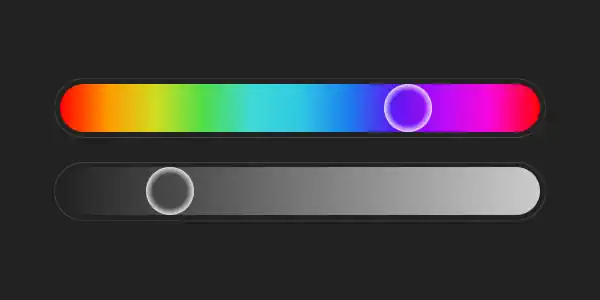

# Leddie

### A really small LED app for Raspberry Pi

The app is built using Python for the server-side logic, React for the front-end UI, and SocketIO for real-time communication between the server and the client. The server-side code is responsible for controlling the WS2812B LED strip, while the React-based front-end provides an interface for users to interact with the strip settings.

# Usage

- Install Python requirements
- Build app using `npm run build` in app directory (remember to install packages with `npm install`)
- Run main program with `main.py`, you can use screen for running the app in background

# TODO

- Fetch current color of LEDs
- CRUD of favorite colors
